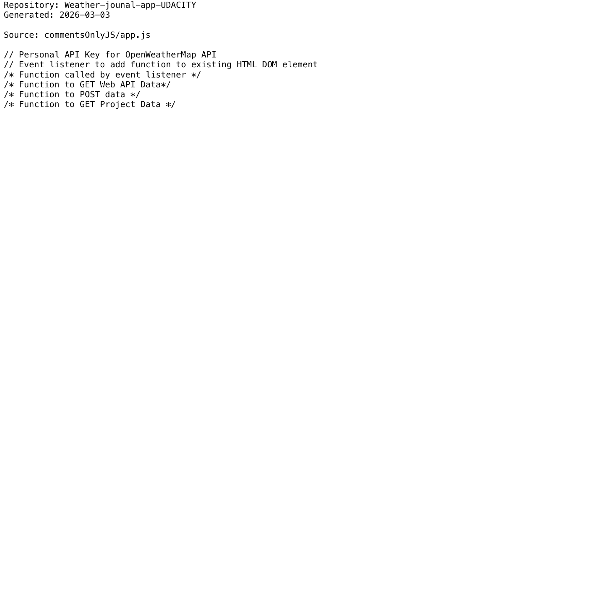

# Project Narrative & Proof

Generated: 2026-03-03

## User Journey
1. Discover the project value in the repository overview and launch instructions.
2. Run or open the build artifact for Weather-jounal-app-UDACITY and interact with the primary experience.
3. Observe output/behavior through the documented flow and visual/code evidence below.
4. Reuse or extend the project by following the repository structure and stack notes.

## Design Methodology
- Iterative implementation with working increments preserved in Git history.
- Show-don't-tell documentation style: direct assets and source excerpts instead of abstract claims.
- Traceability from concept to implementation through concrete files and modules.

## Progress
- Latest commit: 4cb9ee5 (2026-03-02) - docs: add professional README with badges
- Total commits: 6
- Current status: repository has baseline narrative + proof documentation and CI doc validation.

## Tech Stack
- Detected stack: Node.js, GitHub Actions, TypeScript, JavaScript, HTML/CSS

## Main Key Concepts
- Key module area: `commentsOnlyJS`
- Key module area: `node_modules`
- Key module area: `website`

## What I'm Bringing to the Table
- End-to-end ownership: from concept framing to implementation and quality gates.
- Engineering rigor: repeatable workflows, versioned progress, and implementation-first evidence.
- Product clarity: user-centered framing with explicit journey and value articulation.

## Show Don't Tell: Screenshots


## Show Don't Tell: Code Excerpt
Source: `commentsOnlyJS/app.js`

```js
// Personal API Key for OpenWeatherMap API
// Event listener to add function to existing HTML DOM element
/* Function called by event listener */
/* Function to GET Web API Data*/
/* Function to POST data */
/* Function to GET Project Data */
```
